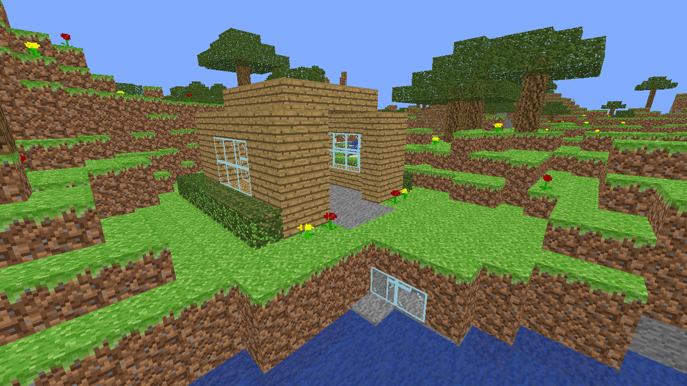

# Minecraft Clone



## Features

This repository contains a small Minecraft clone I did as a side-project to practice my OpenGL and game development skills. The project doesn't use a game engine, and only contains necessary libraries for dealing with OpenGL. The goal was to build a simple but playable version of the game in about a week from scratch, and then slowly keep adding more features on top. So far, the game has:

* Infinite world made up of chunks
* Ability to destroy and place blocks with ray casting
* Procedural terrain generation using [homemade Perlin Noise implementation](https://github.com/daniilsjb/PerlinNoise)
* Water and various other transparent and translucent objects
* 2D objects, such as flowers

There is still much to be done, including more features and optimizations, better architectural decisions, and visual improvements. I am planning to keep updating this repository, so stay tuned if you are interested.

## Building

In case you'd like to build this project, make sure you have a C++17 compiler, CMake, and git:

```shell
# Clone the repository with all the dependencies
git clone --recurse-submodules https://github.com/daniilsjb/MinecraftClone
cd MinecraftClone

# Run CMake to build it
mkdir build
cd build
cmake ..
cmake --build .
```

When running the executable, make sure that the `res` directory is located within the same folder.
